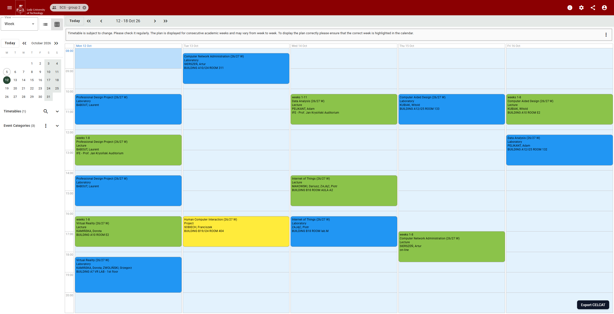
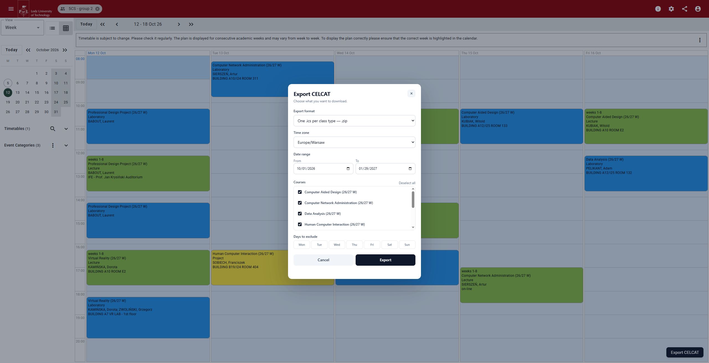

# CELCAT Calendar Exporter

TypeScript browser extension for exporting schedules from the CELCAT calendar used by Lodz University of Technology.

Built with [Extension.js](https://extension.js.org/) for Chrome, Firefox, and Edge.

## Features

- Export schedules as iCalendar (`.ics`), CSV, or JSON.
- Export one `.ics` file containing all classes.
- Export a ZIP with one `.ics` calendar per class type, such as Lecture or Project.
- Select a date range, courses, weekdays, and time zone.
- Use the browser popup or the in-page `Export CELCAT` panel.

## Screenshots

The in-page panel is available directly from the Lodz CELCAT page:



The export dialog provides format, time zone, date range, course, and weekday filters:




> [!NOTE]
> Google Calendar ignores per-event colors in imported `.ics` files. For colored imports, use the ZIP export and import each class-type file into a separate Google Calendar.

## Supported CELCAT Instance

The current manifest targets:

```text
https://lodz.celcat.cloud/cal/*
```

The extension is not currently configured for arbitrary CELCAT installations.

## Development

Install dependencies:

```bash
npm install
```

Start Extension.js development mode:

```bash
npm run dev
```

Build production packages for all supported browsers:

```bash
npm run build
```

Browser-specific builds:

```bash
npm run build:chrome
npm run build:firefox
```

Build output is written to:

```text
dist/chrome
dist/firefox
dist/edge
```

To test a  build manually, load the relevant `dist/<browser>` directory as an unpacked extension in the browser's extension settings.

## Architecture

```text
src/
├── background.ts           CELCAT API requests and downloads
├── content/                In-page button and export panel
├── popup/                  Browser action popup
└── domain/
    ├── celcat.ts           CELCAT response normalization and filtering
    ├── exporters.ts        ICS, CSV, JSON, and category export generation
    ├── models.ts           Shared domain types
    └── timezones.ts        IANA time zone discovery and validation
```
